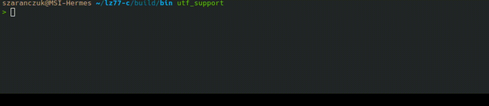

# LZ77 in O(nlogn) with suffix array ANSI C implementation



### build deps:
 - `Any C compiler with support of C99 standard`
 - `CMake at version minimum 3.2`

### GNU build proces:
```
$ mkdir build
$ cd build
$ cmake ..
$ make
```
executables lz77_compress, and lz77_decompress are in buid/bin

### Usage
 - Type `./lz77_compress input_file output_file` to compress input_file, and save its compressed lz77 representation in output_file
 - Type `./lz77_decompress input_file output_file` to decode lz77 representation stored in input_file, and save plain text in output_file

### Limitations

Algorithm may not work correctly if there is any null byte in input file

### TODO:
 - Generalise this to any sequence of bytes
 - Add Burrows-Wheeler transform
 - Add Elias coding for indicies
